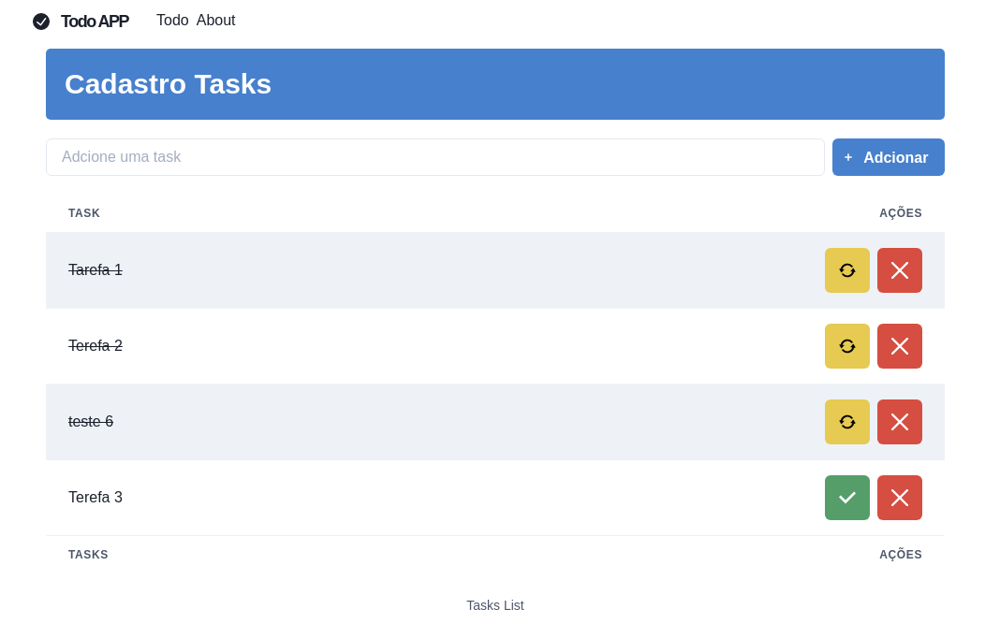

# Project - Todo APP 💻



---

## Developed with 😎

<div align="center">
  
  

  
</div>

---

## Description

This a simple project to create and organize tasks

---
## Installation

```bash
$ yarn install
```

## Running the app

```bash
$ yarn start
```


---
## License 🥰

Copyright © 2021, [Gabriel D. Padua](https://github.com/gabrielDpadua21).
Released under the [MIT license](LICENSE).